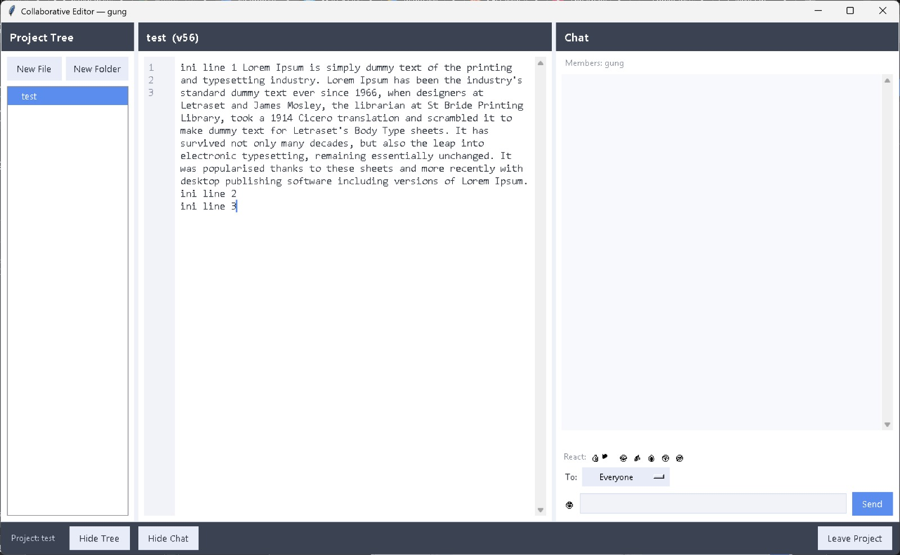
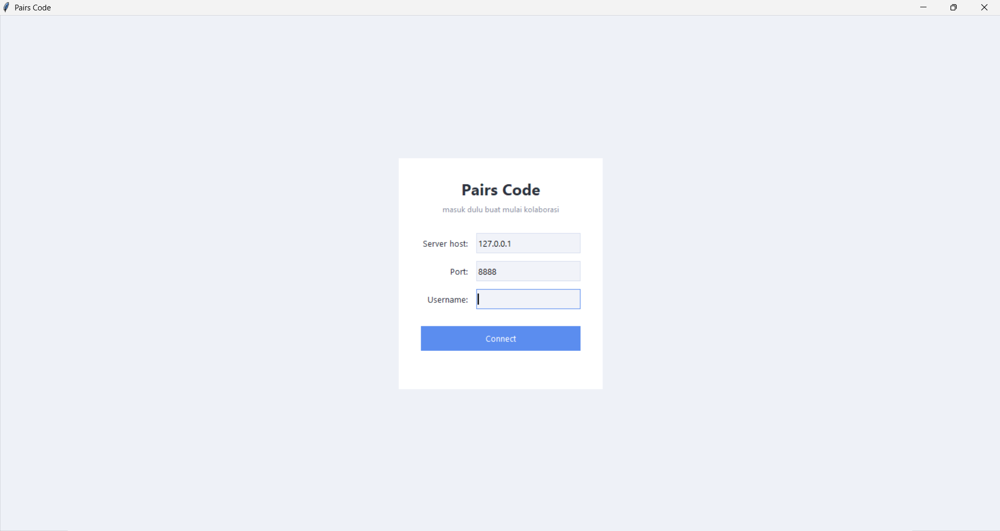
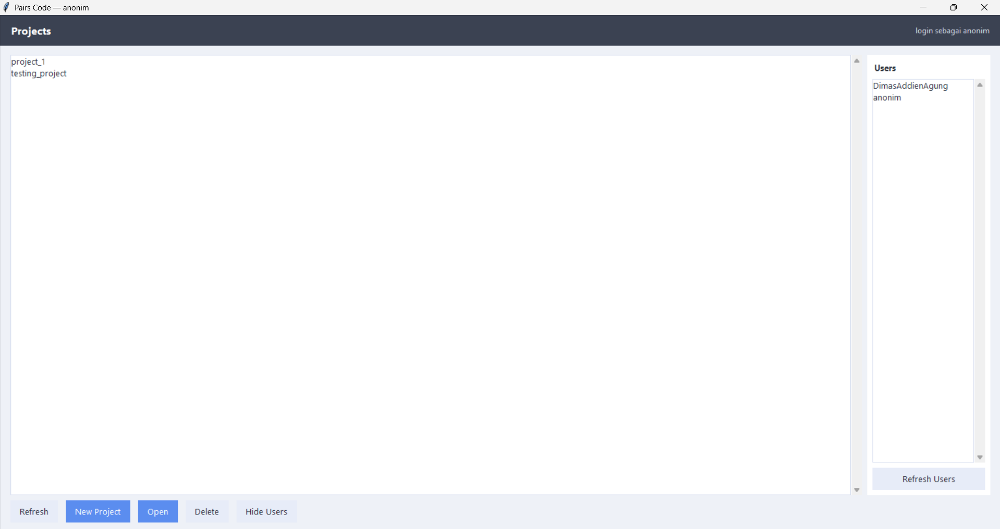
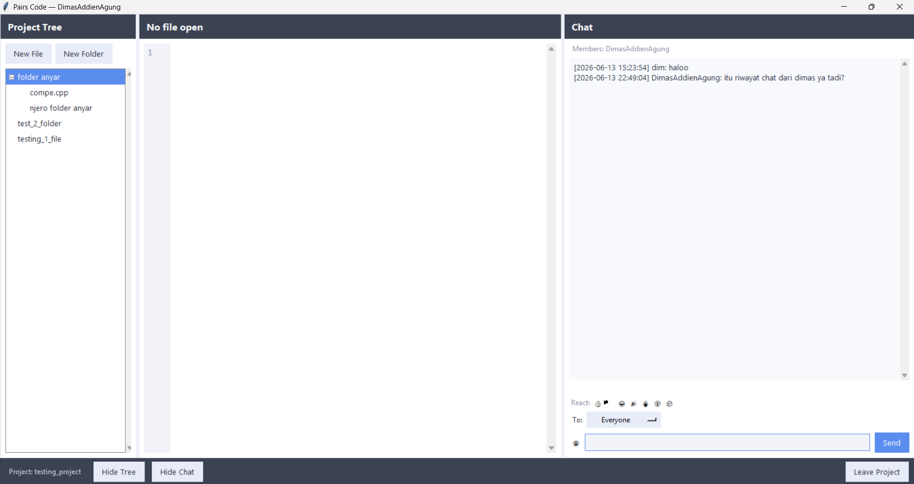
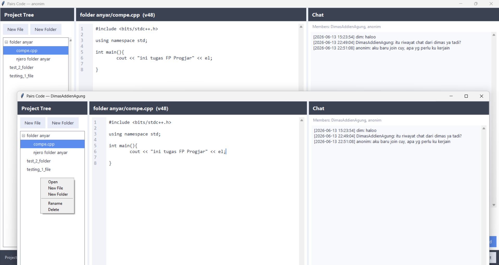
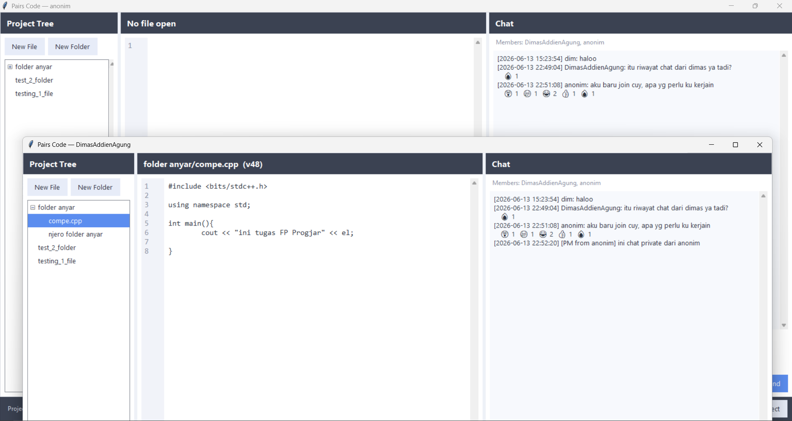
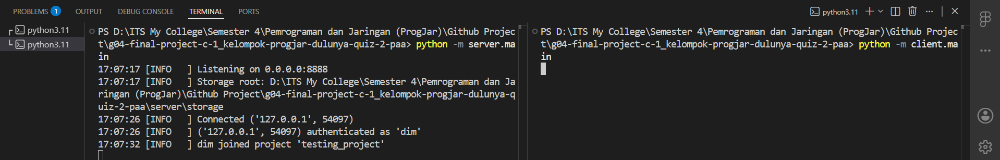

[](https://classroom.github.com/a/90Mprfp5)

# Pairs Code - Collaborative Text Editor (G04)

**Pairs Code** adalah aplikasi penyunting teks **kolaboratif real-time**. Beberapa pengguna dapat masuk ke dalam project yang sama, membuka berkas yang sama, lalu menyuntingnya secara bersamaan. Setiap perubahan yang dilakukan seorang pengguna akan langsung tampil pada layar pengguna lain. Konsepnya menyerupai Google Docs atau fitur Live Share pada Visual Studio Code, namun dibangun langsung di atas socket TCP.

Final Project mata kuliah **Pemrograman Jaringan**.

## Anggota Kelompok

| Nama                              | NRP        | Kelas |
| --------------------------------- | ---------- | ----- |
| Dimas Setiaji                     | 5025241056 |    C   |
| Addien Zafriyan Al Akhsan         | 5025241058 |    C   |
| Raden Kurniawan Agung Fitrianto   | 5025241104 |    C   |

## Link Youtube (Unlisted)

```
https://youtu.be/RYM7qypSAxE
```

---

## Daftar Isi

- [Fitur](#fitur)
- [Cara Menjalankan](#cara-menjalankan)
- [Struktur Folder](#struktur-folder)
- [Cara Kerja (Penjelasan Kode)](#cara-kerja-penjelasan-kode)
  - [Konsep Dasar](#konsep-dasar)
  - [Alur Besar Aplikasi](#alur-besar-aplikasi)
  - [Lapisan Shared (`shared/`)](#lapisan-shared-shared)
  - [Lapisan Server (`server/`)](#lapisan-server-server)
  - [Lapisan Client (`client/`)](#lapisan-client-client)
- [Masalah & Tantangan](#masalah--tantangan)
- [Screenshot Hasil](#screenshot-hasil)

---

## Fitur

- **Login** menggunakan username (unik selama pengguna terhubung).
- **Manajemen project** untuk membuat, menghapus, menampilkan daftar, serta masuk dan keluar project.
- **File tree** untuk membuat berkas atau folder, mengganti nama, dan menghapus; perubahannya langsung terlihat oleh semua anggota.
- **Penyuntingan teks kolaboratif real-time** berbasis Operational Transformation (OT).
- **Chat** per-project beserta riwayat yang tersimpan.
- **Private chat** (direct message) antar pengguna.
- **Reaction** emoji pada pesan chat.
- **Typing indicator** (menampilkan siapa yang sedang mengetik).
- **Presence** untuk menampilkan daftar pengguna yang berada di dalam project.
- **Show all users** untuk menampilkan seluruh pengguna yang sedang online.

---

## Cara Menjalankan

> Dijalankan dari **folder root** project (folder yang memuat `shared/`, `server/`, dan `client/`). Hanya membutuhkan Python 3 standar tanpa dependensi tambahan, karena Tkinter sudah termasuk bawaan Python.

**1. Menjalankan server terlebih dahulu:**

```bash
python -m server.main                 # default bind 0.0.0.0:8888
python -m server.main --port 9000     # mengganti port
python -m server.main --debug         # log lebih detail (setiap edit/typing ikut dicatat)
```

Server dihentikan dengan menekan `Ctrl+C`.

**2. Menjalankan client (GUI):**

```bash
python -m client.main
```

Jalankan **beberapa** client pada terminal berbeda, login dengan username yang berbeda, lalu masuk ke project yang sama. Ketikan pada salah satu client akan langsung muncul pada client lainnya.

**3. (Opsional) Pengujian dan demo tanpa GUI:**

```bash
python -m tools.test_server               # pengujian otomatis end-to-end
python -m tools.cli_client --user alice    # client interaktif berbasis teks
```

---

## Struktur Folder

```
shared/                  # dipakai bersama oleh client & server
  protocol.py            # daftar tipe pesan + pembungkusan/pembacaan pesan (framing)
  ot_models.py           # data class OT bersama

server/
  main.py                # entry point server (argparse: --host --port --storage --debug)
  log_config.py          # konfigurasi logging (console + file)
  core/
    controller.py        # ServerController: accept loop + registry room/user + broadcast
    handler.py           # ClientHandler: 1 thread/koneksi, membaca pesan & dispatch
    room.py              # Room: keanggotaan pengguna pada satu project (presence)
  engines/
    ot_engine.py         # mesin Operational Transformation (inti)
    chat.py              # ChatManager: menyimpan & mengambil riwayat chat
    file_manager.py      # seluruh I/O berkas pada disk (di-sandbox ke storage/)
  storage/               # berkas project pengguna disimpan secara fisik di sini

client/
  main.py                # entry point client, mengatur perpindahan layar Login -> Lobby -> Editor
  network/
    net_client.py        # koneksi socket + thread penerima + queue
  gui/
    login.py             # layar login
    lobby.py             # daftar project + show users
    main_window.py       # tampilan tiga panel (tree | editor | chat)
    file_browser.py      # panel file tree
    editor.py            # panel editor (penerapan OT di sisi client)
    chat_box.py          # panel chat, private chat, reaction, typing
    theme.py             # warna & font agar tampilan konsisten

tools/
  test_server.py            # pengujian end-to-end server
  test_gui_integration.py   # pengujian widget GUI terhadap server sungguhan
  cli_client.py             # client interaktif untuk demonstrasi
```

---

## Cara Kerja (Penjelasan Kode)

### Konsep Dasar

Empat konsep berikut menjadi fondasi seluruh kode.

**a. Socket dan TCP.** *Socket* adalah "ujung saluran" untuk mengirim data antar program melalui jaringan. TCP menjamin data tiba urut dan tidak hilang, tetapi bersifat **stream**: data mengalir terus-menerus tanpa batas pesan yang jelas. Akibatnya, satu pesan yang dikirim bisa tiba terbelah menjadi beberapa bagian, atau dua pesan bisa tiba sekaligus menempel. Karena itu diperlukan cara untuk menandai di mana satu pesan berakhir.

**b. Thread.** Server harus melayani banyak client sekaligus. Apabila server hanya melayani satu per satu, client lain harus menunggu. *Thread* memungkinkan beberapa alur kerja berjalan bersamaan. Pada aplikasi ini, setiap koneksi client dilayani oleh satu thread tersendiri sehingga tidak saling memblokir.

**c. JSON sebagai format pesan.** Setiap pesan dikirim dalam bentuk teks JSON, misalnya `{"packet_type": "CHAT", "message": "halo"}`. JSON dipilih karena mudah dibaca dan didukung langsung oleh Python.

**d. Server sebagai sumber kebenaran dan OT.** Ketika banyak orang mengetik di berkas yang sama, isinya berisiko menjadi berbeda di tiap layar. Untuk mencegahnya, server dijadikan satu-satunya pemegang versi resmi berkas. Setiap perubahan dari client harus melalui server, yang menyesuaikan posisinya bila perlu (proses inilah yang disebut *Operational Transformation*), lalu menyebarkannya kembali. Dengan demikian seluruh client berakhir pada isi yang sama.

### Alur Besar Aplikasi

Sebelum masuk ke detail berkas, berikut gambaran satu siklus penggunaan secara utuh:

```
1. Client connect ke server (TCP), lalu mengirim AUTH (username).
2. Server memverifikasi username, membalas AUTH_RESULT (ok=true).
3. Client meminta PROJECT_LIST, server membalas daftar project.
4. Client mengirim JOIN_PROJECT, server memasukkannya ke Room,
   lalu mengirim balik file tree + riwayat chat + daftar anggota (PRESENCE).
5. Client membuka berkas (FILE_OPEN), server membalas isi + version (FILE_CONTENT).
6. Pengguna mengetik, client mengirim EDIT (berisi version acuan).
7. Server men-transform EDIT, menerapkannya, menyimpan ke disk, menaikkan version,
   lalu BROADCAST hasilnya ke client lain + mengirim ACK ke pengirim.
8. Client lain menerima EDIT dan menerapkannya ke layar masing-masing,
   sehingga semua layar kini identik.
```

Tiga lapisan kode di bawah ini bersama-sama mewujudkan alur tersebut.

---

### Lapisan Shared (`shared/`)

Lapisan ini berisi kode yang dipakai baik oleh client maupun server, sehingga keduanya memiliki acuan yang sama.

#### `shared/protocol.py`

Berkas ini mendefinisikan "bahasa" komunikasi.

**MessageType** adalah kumpulan konstanta nama pesan. Tujuannya agar client dan server tidak salah ketik (misalnya `"EDIT"` vs `"edit"`); keduanya cukup merujuk `MessageType.EDIT`.

```python
class MessageType:
    AUTH = "AUTH"
    JOIN_PROJECT = "JOIN_PROJECT"
    EDIT = "EDIT"
    CHAT = "CHAT"
    # ...dst
```

**`encode()` dan `msg()`** mengubah data Python menjadi *bytes* yang siap dikirim. `msg()` adalah jalan pintas yang paling sering dipakai; fungsi ini menambahkan `packet_type`, mengubahnya menjadi JSON, lalu menambahkan `\n` di akhir.

```python
def encode(payload) -> bytes:
    # menerima dataclass / dict, mengubahnya menjadi JSON + newline
    if hasattr(payload, "to_json"):
        data = payload.to_json()
    elif isinstance(payload, (dict, list)):
        data = json.dumps(payload)
    else:
        data = json.dumps(asdict(payload))
    return (data + "\n").encode("utf-8")

def msg(packet_type: str, **fields) -> bytes:
    body = {"packet_type": packet_type}
    body.update(fields)
    return encode(body)              # -> b'{"packet_type": "...", ...}\n'
```

> **`StreamDecoder` menyelesaikan masalah "TCP itu stream".** Komponen ini menampung byte yang masuk pada sebuah *buffer*, lalu mengeluarkan pesan **hanya jika satu baris utuh (diakhiri `\n`) sudah lengkap**. Sisa yang belum lengkap disimpan untuk digabung dengan data berikutnya.
>
> ```python
> class StreamDecoder:
>     def __init__(self):
>         self._buffer = b""               # penampung byte yang belum lengkap
>
>     def feed(self, chunk: bytes):
>         self._buffer += chunk            # gabungkan data baru
>         while b"\n" in self._buffer:     # selama masih ada batas pesan
>             line, self._buffer = self._buffer.split(b"\n", 1)
>             if line.strip():
>                 yield json.loads(line.decode("utf-8"))   # keluarkan 1 pesan utuh
> ```
>
> `yield` membuat fungsi ini menjadi *generator*, sehingga dapat mengeluarkan beberapa pesan sekaligus (berguna saat dua pesan tiba menempel).

Di bagian bawah berkas terdapat beberapa **dataclass** (`EditPacket`, `ChatPacket`, `TypingPacket`, `FileSystemPacket`). `@dataclass` adalah *decorator* bawaan Python dari modul `dataclasses` yang secara otomatis membuatkan konstruktor (`__init__`) beserta beberapa method pendukung berdasarkan field yang dideklarasikan, sehingga kelas penampung data dapat ditulis ringkas tanpa kode berulang. Anotasi seperti `room_id: str` merupakan *type hint* yang menyatakan tipe data yang diharapkan pada field tersebut. Kumpulan dataclass ini bersifat opsional dan berfungsi sebagai dokumentasi field tiap jenis pesan; pada praktiknya server dan client lebih sering memakai `msg()` secara langsung.

```python
@dataclass
class EditPacket(Packet):
    room_id: str
    user_id: str
    operation: str       # append | insert | delete
    positionS: int
    positionE: int
    content: str
    version: int
```

#### `shared/ot_models.py`

Berisi tiga dataclass yang menggambarkan bentuk data OT (penjelasan `@dataclass` ada pada bagian `protocol.py` di atas). Ketiganya menjadi acuan struktur data bersama agar penamaan field konsisten antar bagian. `TextOperation` mewakili satu operasi penyuntingan (jenis operasi, posisi, isi, penulis, dan versi), `CursorPosition` mewakili posisi kursor seorang pengguna (baris dan kolom), sedangkan `DocumentState` mewakili kondisi sebuah dokumen (isi teks beserta nomor versinya).

```python
@dataclass
class TextOperation:
    operation: str       # insert | delete | append
    position: int
    content: str
    author: str
    version: int

@dataclass
class CursorPosition:
    user_id: str
    line: int
    column: int

@dataclass
class DocumentState:
    room_id: str
    text: str
    version: int
```

---

### Lapisan Server (`server/`)

#### `server/main.py`

Titik masuk server. Membaca argumen baris perintah (`--host`, `--port`, `--storage`, `--debug`) menggunakan `argparse`, menyiapkan logging, membuat objek `ServerController`, lalu menjalankannya. Penekanan `Ctrl+C` ditangkap untuk menghentikan server dengan rapi.

```python
log = setup_logging(logging.DEBUG if args.debug else logging.INFO)

controller = ServerController(host=args.host, port=args.port, storage_root=args.storage)
try:
    controller.start()
except KeyboardInterrupt:
    log.info("Interrupted by user")
finally:
    controller.stop()
```

#### `server/core/controller.py` (`ServerController`)

Otak server. Tanggung jawabnya: membuka socket, menerima koneksi, menyimpan daftar siapa saja yang terhubung, dan menyebarkan pesan.

Saat `start()`, server membuat socket, mengikatnya ke host/port, lalu masuk ke **accept loop** yang terus menunggu koneksi baru. Setiap koneksi baru dibungkus menjadi sebuah `ClientHandler` dan dijalankan pada thread tersendiri.

```python
def start(self):
    self._server_socket = socket.socket(socket.AF_INET, socket.SOCK_STREAM)
    self._server_socket.setsockopt(socket.SOL_SOCKET, socket.SO_REUSEADDR, 1)
    self._server_socket.bind((self.host, self.port))
    self._server_socket.listen(50)
    self._running = True

    while self._running:
        conn, addr = self._server_socket.accept()    # tunggu client baru
        handler = ClientHandler(conn, addr, self)     # buat penangan
        self.register_client(handler)
        handler.start()                               # jalankan di thread sendiri
```

Controller menyimpan beberapa "buku catatan":

- `self._clients` menyimpan semua koneksi yang aktif.
- `self._rooms` memetakan `room_id` ke objek `Room` (menandai siapa berada di project mana).
- `self._users` memetakan `username` ke handler-nya, dipakai untuk private chat agar pesan dapat diarahkan ke orang tertentu.
- `self._taken_usernames` mencegah sebuah username dipakai dua orang sekaligus.

Karena banyak thread mengakses catatan ini bersamaan, semua akses dilindungi `self._lock` (sebuah `RLock`) agar tidak terjadi kondisi balapan (*race condition*). Metode terpentingnya adalah `broadcast_to_room()` yang mengirim satu pesan ke seluruh anggota sebuah room (dengan opsi mengecualikan si pengirim).

```python
def broadcast_to_room(self, room_id, payload, exclude_user=None):
    room = self.get_room(room_id)
    if not room:
        return
    for user_id, handler in room.members():
        if user_id == exclude_user:
            continue
        handler.send_raw(payload)
```

#### `server/core/handler.py` (`ClientHandler`)

Satu objek untuk tiap koneksi, berjalan sebagai *thread*. Inilah yang membaca pesan dari satu client dan menentukan tindakan.

Loop utamanya membaca data, memecahnya menjadi pesan-pesan utuh via `StreamDecoder`, lalu memproses satu per satu.

```python
def run(self):
    while self._open:
        chunk = self.conn.recv(4096)        # baca data mentah
        if not chunk:                       # kosong = koneksi ditutup
            break
        for message in self._decoder.feed(chunk):
            self._dispatch(message)
```

`_dispatch()` berfungsi sebagai **tabel perutean** yang melihat `packet_type` lalu memanggil fungsi penangan yang sesuai. Ada satu aturan penting, yaitu kecuali pesan `AUTH`, semua pesan ditolak bila pengguna belum login.

```python
def _dispatch(self, message):
    ptype = message.get("packet_type")
    if ptype == MessageType.AUTH:
        return self._handle_auth(message)
    if self.username is None:                         # belum login, tolak
        return self.error("Not authenticated", code="AUTH_REQUIRED")

    handlers = {
        MessageType.JOIN_PROJECT: self._handle_join_project,
        MessageType.EDIT:         self._handle_edit,
        MessageType.CHAT:         self._handle_chat,
        # ...semua jenis pesan lain
    }
    func = handlers.get(ptype)
    if func is None:
        return self.error(f"Unknown packet_type: {ptype!r}", code="UNKNOWN_TYPE")
    func(message)
```

Sebagai contoh penangan, `_handle_chat` menyimpan pesan ke riwayat lalu menyebarkannya ke seluruh anggota room. Pola yang sama dipakai hampir semua fitur, yaitu **terima, proses, lalu sebarkan ke room**.

```python
def _handle_chat(self, message):
    room_id = self._require_room(message)
    if room_id is None:
        return
    text = message.get("message") or ""
    entry = self.controller.chat_manager.add_message(room_id, self.username, text)
    self.controller.broadcast_to_room(
        room_id,
        msg(MessageType.CHAT, room_id=room_id, id=entry["id"], sender_id=self.username,
            message=text, timestamp=entry["timestamp"]),
    )
```

Penangan lain mengikuti peran masing-masing: `_handle_auth` memvalidasi dan mengklaim username; `_handle_join_project` memasukkan pengguna ke `Room` lalu mengirim file tree dan riwayat chat; `_handle_private_chat` mengarahkan pesan ke satu pengguna tertentu; `_handle_typing` dan `_handle_reaction` memproses lalu menyebarkan ke room. Semua penangan dibungkus `try/except`, sehingga kesalahan pada satu pesan tidak mematikan koneksi; server cukup membalas pesan `ERROR`.

#### `server/core/room.py` (`Room`)

Kelas yang mencatat siapa saja yang sedang berada di satu project, dalam bentuk pemetaan `user_id` ke handler. Berfungsi sebagai dasar fitur *presence* dan untuk menentukan tujuan *broadcast*. Seluruh aksesnya dilindungi lock.

```python
class Room:
    def __init__(self, room_id):
        self.room_id = room_id
        self._members = {}              # user_id -> ClientHandler
        self.lock = threading.RLock()

    def add_member(self, user_id, handler):
        with self.lock:
            self._members[user_id] = handler

    def remove_member(self, user_id):
        with self.lock:
            self._members.pop(user_id, None)

    def member_ids(self):
        with self.lock:
            return sorted(self._members.keys())

    def is_empty(self):
        with self.lock:
            return not self._members    # untuk auto-hapus room kosong
```

#### `server/engines/ot_engine.py` (`OTEngine`)

> **Operational Transformation adalah jantung kolaborasi.** Server menyimpan tiap berkas sebagai objek `Document` yang berisi `text` (isi resmi), `version` (nomor versi), dan `history` (daftar seluruh operasi yang pernah diterapkan).

Masalah yang dipecahkan: bila berkas berisi `"halo"` lalu dua orang menyisipkan huruf pada posisi 0 secara bersamaan, penerapan apa adanya bisa membuat hasil berbeda di tiap layar. Solusinya, setiap operasi yang datang ditransformasikan terhadap operasi-operasi yang sudah masuk lebih dulu agar posisinya tetap benar.

Contoh aturan untuk dua operasi *insert*:

```python
def _xf_insert_insert(a, b):
    # a diterapkan SETELAH b. Bila a berada di belakang b, posisinya digeser
    # sejauh panjang teks yang disisipkan oleh b.
    if a["position"] < b["position"]:
        return a
    return {**a, "position": a["position"] + len(b["content"])}
```

Terdapat empat kombinasi yang ditangani (insert-insert, insert-delete, delete-insert, delete-delete), seluruhnya disatukan oleh fungsi `transform(a, b)`. Alur penerapan satu edit ada pada `apply_edit()`.

```python
def apply_edit(self, room_id, path, edit):
    doc = self.get_document(room_id, path)
    with doc.lock:                                  # proses satu per satu
        base_version = int(edit.get("version", doc.version))
        op = self._normalize(edit, doc.text)        # ubah ke bentuk baku

        # rebase: transform op terhadap semua op yang masuk sejak versi acuan client
        for past_op in doc.history[base_version:doc.version]:
            op = transform(op, past_op)

        doc.text = self._apply_to_text(doc.text, op)  # terapkan ke teks resmi
        doc.history.append(op)
        doc.version = len(doc.history)                 # naikkan versi
        self.file_manager.write_file(room_id, path, doc.text)  # simpan ke disk
        return op, doc.version, doc.text
```

Karena seluruh perubahan diurutkan dan ditransformasikan oleh satu pihak (server), semua client pada akhirnya **konvergen** ke isi yang sama. `doc.lock` memastikan dua edit yang tiba bersamaan tidak saling menimpa. `OTEngine` juga menyediakan `get_document()` (memuat isi berkas dari disk saat pertama dibuka) dan `drop_document()` (membuang berkas dari cache ketika berkas/project dihapus).

#### `server/engines/chat.py` (`ChatManager`)

Mengelola riwayat chat per room dan menyimpannya ke berkas JSON agar tidak hilang saat server dimuat ulang. Saat dibuat, ia memuat riwayat lama; setiap pesan baru ditambahkan lalu disimpan kembali. Tiap pesan diberi `id` unik (8 karakter) agar bisa dirujuk oleh fitur reaction.

```python
def add_message(self, room_id, sender_id, message):
    entry = {
        "id": uuid.uuid4().hex[:8],
        "sender_id": sender_id,
        "message": message,
        "timestamp": time.strftime("%Y-%m-%d %H:%M:%S"),
        "reactions": {},
    }
    with self._lock:
        bucket = self._history.setdefault(room_id, [])
        bucket.append(entry)
        if len(bucket) > self.history_limit:        # batasi panjang riwayat
            del bucket[: -self.history_limit]
        self._save()                                # tulis ke file JSON
    return entry
```

`toggle_reaction()` menambah atau menghapus reaksi seorang pengguna pada sebuah pesan; menekan emoji yang sama dua kali akan membatalkannya.

```python
def toggle_reaction(self, room_id, message_id, emoji, user):
    with self._lock:
        for entry in self._history.get(room_id, []):
            if entry.get("id") == message_id:
                users = entry["reactions"].setdefault(emoji, [])
                if user in users:
                    users.remove(user)              # sudah bereaksi -> batalkan
                    if not users:
                        del entry["reactions"][emoji]
                else:
                    users.append(user)              # belum -> tambahkan
                self._save()
                return entry
        return None
```

#### `server/engines/file_manager.py` (`FileManager`)

Satu-satunya tempat yang menyentuh *filesystem*. Satu project sama dengan satu folder di dalam `storage/`. Berisi operasi seperti `list_projects`, `create_project`, `delete_project`, `read_file`, `write_file`, `create_file`, `create_dir`, `delete`, dan `rename`. Metode `build_tree()` menyusun struktur folder bertingkat untuk ditampilkan GUI.

```python
def build_tree(self, room_id):
    root = self.project_path(room_id)

    def walk(directory):
        nodes = []
        for entry in sorted(os.listdir(directory)):
            full = os.path.join(directory, entry)
            if os.path.isdir(full):
                nodes.append({"type": "dir", "name": entry, "children": walk(full)})
            else:
                nodes.append({"type": "file", "name": entry})
        nodes.sort(key=lambda n: (n["type"] != "dir", n["name"].lower()))  # folder dulu
        return nodes

    with self._lock:
        return walk(root)
```

> **Seluruh path divalidasi agar tidak dapat keluar dari folder `storage/`.** Validasi dilakukan oleh `_safe_abs()`; tanpa pengaman ini, input seperti `../../` berpotensi mengakses berkas sistem di luar area yang diizinkan (*path traversal*).
>
> ```python
> def _safe_abs(self, *parts):
>     joined = os.path.abspath(os.path.join(self.storage_root, *parts))
>     if os.path.commonpath([joined, self.storage_root]) != self.storage_root:
>         raise FileManagerError("Path escapes storage root")
>     return joined
> ```

#### `server/log_config.py`

Menyiapkan logging ke console sekaligus ke berkas dengan rotasi (`server/logs/server.log`). Opsi `--debug` menaikkan tingkat detail. Berkas ini juga mengatur encoding `stdout` agar emoji/unicode tetap aman ditampilkan pada console Windows.

```python
def setup_logging(level=logging.INFO):
    logger = logging.getLogger("server")
    logger.setLevel(level)
    if logger.handlers:                 # sudah pernah di-setup
        return logger

    fmt = logging.Formatter("%(asctime)s [%(levelname)-7s] %(message)s", datefmt="%H:%M:%S")

    # agar stdout kuat menampung unicode di console Windows (cp1252)
    try:
        sys.stdout.reconfigure(encoding="utf-8", errors="replace")
    except (AttributeError, ValueError):
        pass

    console = logging.StreamHandler(sys.stdout)
    console.setFormatter(fmt)
    logger.addHandler(console)

    file_handler = RotatingFileHandler(LOG_FILE, maxBytes=1_000_000, backupCount=3, encoding="utf-8")
    file_handler.setFormatter(fmt)
    logger.addHandler(file_handler)
    return logger
```

---

### Lapisan Client (`client/`)

#### `client/main.py` (`App`)

Mengatur jalannya aplikasi dengan satu jendela utama yang berganti-ganti menampilkan layar Login, Lobby, lalu Editor. Metode `_swap()` menghapus layar lama dan memasang layar baru.

```python
def _swap(self, frame):
    if self.current_frame is not None:
        self.current_frame.destroy()    # buang layar lama
    self.current_frame = frame
    frame.pack(fill="both", expand=True)
```

Yang juga penting, `App` memanggil `self.net.pump()` setiap 50 ms melalui `root.after`. Inilah yang menjembatani data jaringan ke GUI.

```python
def _pump(self):
    self.net.pump()                 # proses pesan jaringan di main thread
    self.root.after(50, self._pump) # jadwalkan lagi 50 ms berikutnya
```

#### `client/network/net_client.py` (`NetClient`)

> **Tkinter memiliki satu aturan penting, yaitu widget hanya boleh diakses dari main thread.** Padahal data jaringan tiba kapan saja pada thread lain, sehingga memperbarui widget langsung dari thread jaringan dapat menyebabkan crash.

Solusinya menggunakan **antrian (queue) sebagai jembatan**. Thread jaringan hanya menaruh pesan ke antrian; main thread yang mengambil dan memperbaruinya.

```python
def _listen(self):                 # berjalan di THREAD jaringan
    while self.connected:
        chunk = self.sock.recv(4096)
        if not chunk:
            break
        for message in self._decoder.feed(chunk):
            self._inbox.put(message)        # hanya masuk antrian

def pump(self):                    # berjalan di MAIN thread (dipanggil root.after)
    while not self._inbox.empty():
        message = self._inbox.get_nowait()
        handler = self._handlers.get(message.get("packet_type"))
        if handler:
            handler(message)                # pembaruan widget aman di sini
```

`set_handlers()` dipakai tiap kali berpindah layar untuk mengganti tabel "siapa menangani pesan apa".

#### `client/gui/theme.py`

Kumpulan konstanta warna/font dan beberapa helper agar tampilan seluruh layar konsisten. Tidak ada logika jaringan di sini, murni tampilan.

```python
FONT       = ("Segoe UI", 10)
FONT_TITLE = ("Segoe UI", 18, "bold")

BG     = "#eef1f7"   # latar aplikasi
PANEL  = "#ffffff"   # isi panel
HEADER = "#3b4252"   # bar header (gelap)
ACCENT = "#5b8def"   # warna utama (tombol penting)

def button(parent, text, command, primary=False, **kw):
    bg, fg, active = (ACCENT, "white", "#4a7be0") if primary else (ACCENT2, TEXT, "#d7deef")
    return tk.Button(parent, text=text, command=command, font=FONT, bg=bg, fg=fg,
                     activebackground=active, relief="flat", bd=0, padx=12, pady=5,
                     cursor="hand2", **kw)
```

#### `client/gui/login.py` (`LoginFrame`)

Layar pertama. Pengguna mengisi host, port, dan username. Saat menekan **Connect**, client mencoba `net.connect()`, lalu mengirim `AUTH` dan memasang handler untuk menunggu balasan `AUTH_RESULT`.

```python
def _connect(self):
    host = self.host_entry.get().strip()
    username = self.user_entry.get().strip()
    port = int(self.port_entry.get().strip())

    self.net.connect(host, port)                    # buka koneksi TCP

    self.net.set_handlers(
        {MessageType.AUTH_RESULT: self._on_auth_result},
        on_disconnect=self._on_disconnect,
    )
    self.net.username = username
    self.net.send(MessageType.AUTH, username=username)

def _on_auth_result(self, message):
    if message.get("ok"):
        self.on_logged_in(self.net.username)        # lanjut ke lobby
    else:
        self.status.config(text=message.get("message", "Auth failed"))
```

#### `client/gui/lobby.py` (`LobbyFrame`)

Menampilkan daftar project dan daftar pengguna online. Aksi pengguna (refresh, create, open, delete, show users) cukup mengirim pesan ke server; tampilan diperbarui ketika balasannya tiba melalui handler.

```python
def _register_handlers(self):
    self.net.set_handlers({
        MessageType.PROJECT_LIST_RESULT:   self._on_project_list,
        MessageType.SHOW_ALL_USERS_RESULT: self._on_users,
        MessageType.ACK:                   self._on_ack,
        MessageType.ERROR:                 self._on_error,
    })

def _on_project_list(self, message):
    self.listbox.delete(0, tk.END)
    for name in message.get("projects", []):
        self.listbox.insert(tk.END, name)           # isi ulang daftar project
```

#### `client/gui/main_window.py` (`EditorScreen`)

Tampilan kerja utama dengan tiga panel berdampingan (file tree, editor, chat). Tugas utamanya adalah mengarahkan tiap jenis pesan dari server ke panel yang tepat melalui satu tabel handler.

```python
self.net.set_handlers({
    MessageType.FILE_LIST_RESULT: self._on_file_list,
    MessageType.FILE_CONTENT:     self.editor_panel.load_content,
    MessageType.EDIT:             self.editor_panel.apply_remote,
    MessageType.CHAT:             self.chat_panel.add_message,
    MessageType.PRESENCE:         self.chat_panel.update_presence,
    MessageType.TYPING:           self.chat_panel.update_typing,
    # ...dst
})
```

Tombol pada bilah bawah memungkinkan menyembunyikan panel tree/chat dan keluar dari project.

#### `client/gui/file_browser.py` (`ProjectTreeFrame`)

Menampilkan struktur folder project dari data `FILE_LIST_RESULT`. Aksi membuat, menghapus, atau mengganti nama hanya mengirim pesan `FILE_SYSTEM` ke server; server kemudian menyebarkan tree terbaru ke semua orang. Klik ganda pada berkas membukanya di editor.

```python
def _create_file(self):
    name = simpledialog.askstring("New File", "File name:", parent=self)
    if not name:
        return
    path = "/".join(p for p in (self._target_dir(), name) if p)
    self.net.send(MessageType.FILE_SYSTEM, room_id=self.room_id,
                  operation="CREATE_FILE", path=path)

def _on_double_click(self, event):
    item = self.tree.identify_row(event.y)
    if item and self._get_type(item) == "file":
        self.on_open_file(self._node_path(item))    # buka file di editor
```

#### `client/gui/editor.py` (`TextEditorFrame`)

> **Pada sisi client, ketikan diterjemahkan menjadi operasi melalui perbandingan teks.** Setiap kali pengguna mengetik, isi editor terkini dibandingkan dengan "shadow" (salinan teks terakhir yang sudah tersinkron) untuk menemukan bagian yang berubah, dengan mencocokkan bagian awal (*prefix*) dan akhir (*suffix*) yang sama.

```python
def _emit_diff(self, old, new):
    # cari prefix yang sama
    p = 0
    while p < min(len(old), len(new)) and old[p] == new[p]:
        p += 1
    # cari suffix yang sama
    s = 0
    while s < (len(old) - p) and s < (len(new) - p) and old[-1 - s] == new[-1 - s]:
        s += 1
    deleted  = old[p: len(old) - s]     # bagian yang hilang  -> kirim EDIT delete
    inserted = new[p: len(new) - s]     # bagian yang muncul  -> kirim EDIT insert
```

Sebaliknya, `EDIT` dari pengguna lain diterapkan ke widget dengan penanda `_applying_remote = True`. Tanpa penanda ini, perubahan dari server akan memicu event "Modified" pada widget dan terkirim balik ke server tanpa henti (perulangan tak terhingga). Posisi pada jaringan memakai **offset karakter** (angka), lalu dikonversi ke format Tkinter `"baris.kolom"` di client, sehingga logika OT di server cukup berurusan dengan angka.

#### `client/gui/chat_box.py` (`ChatFrame`)

Menangani seluruh fitur komunikasi: chat grup, private chat (memilih tujuan via menu **To:**), reaction emoji, dan typing indicator. Saat mengirim, panel membedakan tujuan: bila tujuannya bukan "Everyone", pesan dikirim sebagai `PRIVATE_CHAT`.

```python
def _send_message(self):
    content = self.message_entry.get().strip()
    if not content:
        return
    recipient = self.recipient_var.get()
    if recipient and recipient != EVERYONE:
        self.net.send(MessageType.PRIVATE_CHAT, room_id=self.room_id,
                      sender_id=self.net.username, target_id=recipient, message=content)
    else:
        self.net.send(MessageType.CHAT, room_id=self.room_id,
                      sender_id=self.net.username, message=content)
    self.message_entry.delete(0, tk.END)
```

Untuk typing indicator, demi menghindari banjir paket, client mengirim `TYPING(true)` sekali saat mulai mengetik, lalu otomatis mengirim `TYPING(false)` setelah jeda sekitar 1,2 detik.

```python
def _on_keyrelease(self, event):
    if not self._typing_active:
        self._typing_active = True
        self.net.send(MessageType.TYPING, room_id=self.room_id,
                      user_id=self.net.username, is_typing=True)
    if self._typing_send_after is not None:
        self.after_cancel(self._typing_send_after)
    self._typing_send_after = self.after(1200, self._stop_typing)   # auto-stop 1,2 detik
```

---

## Masalah & Tantangan

Beberapa kendala yang dihadapi selama pengembangan beserta penyelesaiannya:

**1. Menjaga konsistensi teks saat banyak pengguna menyunting bersamaan.**
Ini merupakan tantangan utama. Apabila dua pengguna menyunting pada posisi yang sama, isi berkas mudah menjadi berbeda di tiap layar. Diatasi dengan **Operational Transformation**. Server mentransformasikan setiap operasi terhadap operasi yang telah masuk sebelumnya, sehingga seluruh layar pada akhirnya konvergen.

**2. Pesan terpotong pada TCP.**
Pada awalnya sempat terjadi error saat parsing JSON karena satu pesan terbaca sebagian, atau dua pesan menempel menjadi satu. Diatasi dengan **framing `\n` dan `StreamDecoder`** yang menampung byte dan hanya mengeluarkan pesan setelah satu baris utuh diterima.

**3. GUI Tkinter rentan crash bila diperbarui dari thread jaringan.**
Hal ini terjadi karena Tkinter tidak bersifat thread-safe. Diatasi dengan pola **queue dan `pump()`**. Thread jaringan hanya menaruh pesan ke antrian, sedangkan pembaruan widget dilakukan oleh main thread.

**4. Edit dari server berisiko terkirim balik karena dianggap ketikan sendiri.**
Saat menerima `EDIT` dari pengguna lain, widget berubah sehingga event "Modified" terpicu, dan perubahan tersebut nyaris terkirim kembali ke server secara berulang. Diatasi dengan flag `_applying_remote` yang menonaktifkan pengiriman selama perubahan dari luar sedang diterapkan.

**5. Typing indicator membanjiri lalu lintas paket.**
Jika setiap penekanan tombol mengirim paket TYPING, server akan kebanjiran pesan. Diatasi dengan **mengirim `TYPING(true)` satu kali di awal**, lalu otomatis mengirim `TYPING(false)` setelah pengguna berhenti mengetik sekitar 1,2 detik.

**6. Nomor baris editor tidak sejajar saat baris panjang (word-wrap).** *(known issue)*
Gutter nomor baris menghitung **baris logis** (jumlah `\n`), sementara editor menggunakan `wrap="word"` sehingga satu baris panjang **dibungkus menjadi beberapa baris visual**. Akibatnya, ketika sebuah baris ter-wrap, nomor dan teks menjadi tidak sejajar. Solusi yang lebih rapi adalah menonaktifkan wrap (`wrap="none"`) disertai scrollbar horizontal, atau menghitung baris visual menggunakan `count(..., "displaylines")`. Untuk saat ini hal tersebut dicatat sebagai keterbatasan.




**7. Berkas yang sedang dibuka dihapus oleh pengguna lain.**
Apabila pengguna lain menghapus atau mengganti nama berkas yang sedang dibuka, editor harus menutup berkas tersebut dengan aman tanpa crash. Server melakukan `drop_document` pada cache OT, dan client menutup editornya ketika tree diperbarui.

---

## Screenshot Hasil

**1. Halaman Login**



**2. Lobby / Daftar Project (+ Show Users)**



**3. Tampilan Tiga Panel (File Tree | Editor | Chat)**



**4. Dua Client Menyunting Bersamaan (kolaborasi real-time)**



**5. Fitur Chat (group, private chat, reaction, typing)**



**6. Terminal Server Berjalan**


